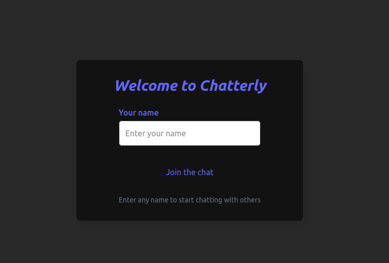
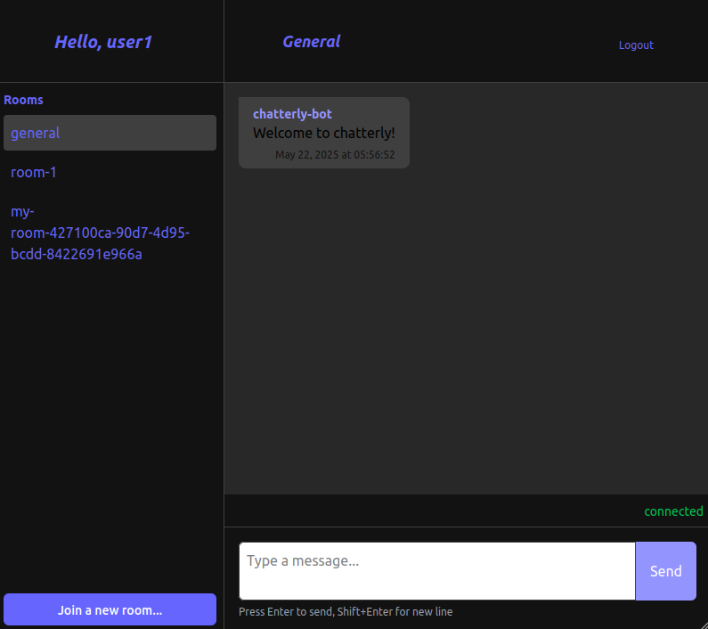
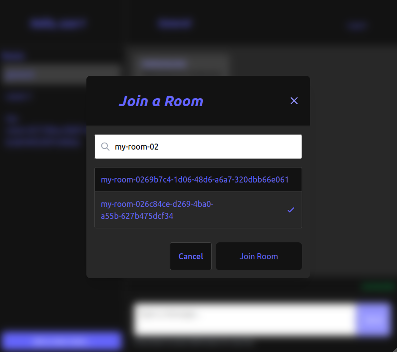
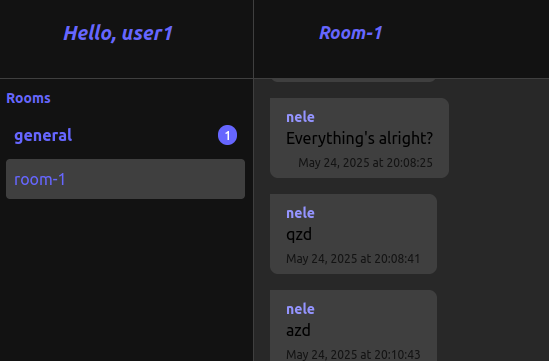
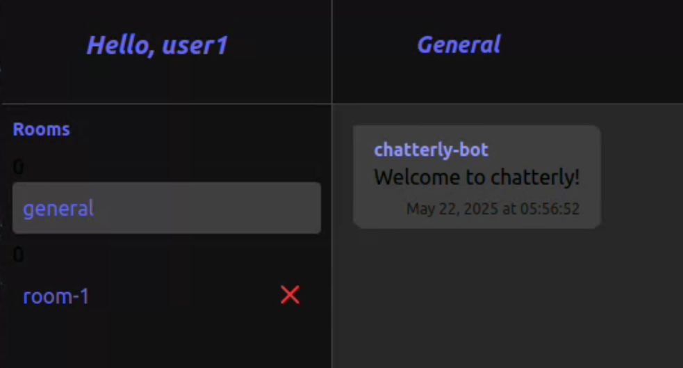

# chat-app

Welcome to Chatterly, a chat website to talk with people! This project provides a minimalistic chat app which uses the [chat-server](https://github.com/Knoblauchpilze/chat-server) backend to handle message routing and room management.





# Badges

[](https://github.com/Knoblauchpilze/chat-app/actions/workflows/build-and-push.yml)

[](https://codecov.io/gh/Knoblauchpilze/chat-app)

# Installation

## Prerequisites

This project requires the following tools to be installed on your machine:
* [node](https://nodejs.org/en/download)
* [docker](https://docs.docker.com/engine/install/ubuntu/) (for Ubuntu but can be adapted for other OS)

## Setup the repository

Once the tools are available, you can clone the repository locally:

```bash
git clone git@github.com:Knoblauchpilze/chat-app.git
```

After this you can install the dependencies and start the preview of the website:

```bash
cd /path/to/the/repo
make install
make dev
```

This should open a new tab in your default browser showing the website.

## Work with the server

In and of itself the frontend does not do much: in order to fully leverage the project it is recommended to also install the [chat-server](https://github.com/Knoblauchpilze/chat-server). You can follow the [installation](https://github.com/Knoblauchpilze/chat-server?tab=readme-ov-file#installation) section there to start the server. This will allow you to fully use the features provided by this frontend.

## Additional information

This project was generated from the [template-frontend](https://github.com/Knoblauchpilze/template-frontend) project.

# What is this project about?

The project's goal is to provide a minimalistic chat app where multiple users can post messages and interact in shared rooms. No registration is needed: you can just pick a name and start chatting. There are no passwords, meaning that if you pick a name that was already used you will see all the existing messages for this user.

It is meant as a toy project to get more knowledge on the following concepts:
* handling of SSE in the server
* attempt to provide a better looking UI than other past projects
* have fun chatting with people

# How does this project work?

## The routes

A couple of routes are available in the project:
* the home route is the login screen
* upon successful registration the user is redirected to `/chats/rooms/room-id`

The user can logout at any moment and also visit the different rooms they are registered into.

## Login

The login screen is really simple:


You can notice the absence of password: as this project is a toy app, the choice was made to just use usernames and not protect the chats. This has some advantages as it reduces the barriers to start chatting with people but it's obviously a massive security problem. For anything more than a toy project this should be changed.

Note that although there's no login system, the server knows about API users: this theoretically allows to integrate the [user-service](https://github.com/Knoblauchpilze/user-service) logic and have something similar to what is done over in the [galactic-sovereign](https://github.com/Knoblauchpilze/galactic-sovereign) project with a real username and password and potentially multiple chat alias.

Upon logging in, any user will be automatically registered in a `general` room where all users can chat together.

## Chatting with people

The main room view looks like the image below:


On the left panel the user can see all the rooms they belong to. They can also join new rooms by clicking on the button in the bottom left. This will toggle a modal like the following:



There the user can look for a room to join by name. There's a fuzzy matching logic to help filtering the rooms. When the desired room is found, the user can select it and click on `Join room`. It will trigger a REST call to the server to register the user in the room and reload the page.

On any room, the user an type a message and send it. The details about how this works in the backend are presenting in the dedicated section of the corresponding README (see [here](https://github.com/Knoblauchpilze/chat-server?tab=readme-ov-file#how-does-this-work)): the general idea is that the message will be sent and if it succeeds to be registered (i.e. the user is allowed to send the message) it will be broadcast to all currently connected clients, including the original client. It should be visible immediately in the UI.

In case amessage is received in a different room than the user currently sees, a notification system will be visible to represent how many unread messages are available in other rooms:



## Leaving a room

The user can leave any room they belong to except the `general` one. This can be achieved by hovering over the name of a room and clicking the cross:



When the mouse is on the cross it becomes red. There are no confirmation and when the user clicks a request will be made to the server to unregister the user from the room. In case it is the room currently being displayed the page will be reloaded to another room.

All messages belonging to users leaving a room will be re-assigned to a common `ghost` user, registered in all room.
